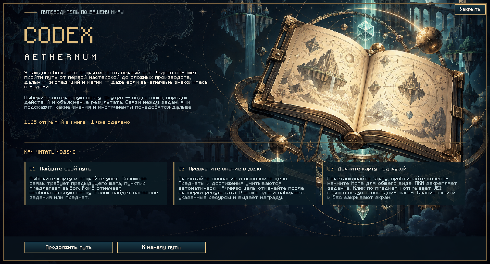

# Codex Aeternum

Квестовая книга для Minecraft 1.21.1 / NeoForge 21.1. Русский и английский языки,
серверный прогресс, сдача ресурсов, награды, JEI и Ponder.

Версия 0.3.0: **1165 заданий, 106 тематических глав, 20 карт прогрессии**.
Каждое задание описано для новичка: назначение, где и как получить, порядок
действий, проверка результата. 204 факультативные боковые ветки учат диагностике,
автоматизации, снабжению и экспедициям. Крупные карты объединяют задания разных
глав в общий граф: обязательные предпосылки, альтернативные пути и специализации.

Книга открывается вступительным экраном Codex Aethernum: назначение, три шага
чтения, прогресс и переход к карте. Все экраны выдержаны в одной палитре —
ночной синий, бирюза и золото.



[Отчёт о проверках 0.3.0](docs/validation.md) · [история версий](docs/release-history.md).

## Игра

Положите JAR в `mods` клиента и сервера. На обеих сторонах нужна одна и та же
версия: сетевой протокол версионируется отдельно от номера релиза. Без мода на сервере
книга работает как локальный справочник без выдачи наград.

| Действие | Управление |
|---|---|
| Открыть книгу | `K` (настраивается) или `/codex`; первый раз — вступление, затем «Обложка» возвращает к нему |
| Переместить карту | Перетаскивание ЛКМ |
| Изменить масштаб | Колесо мыши |
| Вписать карту в экран | `Home` или «Вписать» |
| Открыть задание / поставить закладку | ЛКМ / ПКМ по узлу |
| Найти задание | Поиск по названию или ID предмета, `Enter` / `F3` — следующий результат |
| Перейти к предпосылке или следующему заданию | Ссылка в описании |
| Прочитать введения в главы | «Обзор» |
| Открыть рецепт / применение | ЛКМ / ПКМ по предмету цели при установленном JEI |

Сплошные связи означают обязательные предпосылки. Пунктир — достаточно одного
из перечисленных путей; обязательные предпосылки при этом тоже нужны.
Необязательные задания помечены ромбом. Цели-достижения показаны человеческим
действием («Победить Игниса на Горящей арене»), а не техническим ID.

18 производственных проектов дополняют книгу 54 заданиями: подготовить оборудование,
получить партию продукции, проверить работу линии. Последний шаг подтверждается
игроком вручную по конкретным критериям. Наличие блоков в инвентаре само по себе
не доказывает, что фабрика построена и работает.

Сервер хранит прогресс в `<мир>/codex/<uuid>.json`, предыдущую сохранённую версию —
в `.bak`. Повреждённый файл сохраняется отдельно при восстановлении из резервной
копии. Все **907 исходных идентификаторов заданий** сохранены; выполненные задания
не переименованы и не удалены. Для ещё не выполненных заданий действуют новые связи.

## Сборка и проверки

Нужны JDK 21 и Python 3. Gradle скачивает зависимости при первой сборке.

```sh
python3 -m unittest discover -s tools/tests
python3 tools/build_book.py --check
./gradlew build
```

Артефакт: `build/libs/codex-aeternum-0.3.0.jar`.
`build` запускает Java-регрессии модели и сохранений. Python-проверки и соответствие
сгенерированных ресурсов запускаются отдельно и включены в CI.

Изолированный клиент разработки:

```sh
./gradlew runClient
```

Его настройки, моды и тестовые миры находятся в `build/run`. Проверка с полным
набором сторонних модов должна выполняться также через обычный лаунчер:
не все моды поддерживают именования методов среды разработки.

## Редактирование книги

| Файл | Назначение |
|---|---|
| `tools/c_*.py`, `tools/en_*.py` | Исходные задания, цели и награды, английские названия |
| `tools/guides/<карта>.json`, `tools/guidebook.py` | Полная редакция: описания всех заданий и введений RU/EN, пояснения целей, новые ветки `guide_*`; формат — [`docs/authoring-contract.md`](docs/authoring-contract.md) |
| `tools/progression.py` | Входы в главы, развилки, общий граф и координаты |
| `tools/editorial.py`, `tools/registry_corrections.py` | Исправления объяснений, целей и ссылок по реестру игры |
| `tools/curriculum.py` | Практические производственные проекты |
| `tools/rewards.py`, `tools/polish.py` | Награды и введения |
| `tools/book_compiler.py` | Проверка схемы, ссылок, циклов, переводов и локализация |
| `tools/build_book.py` | Загрузка исходников и выпуск ресурсов |

После редактирования выполните `python3 tools/build_book.py` и проверки выше.
Компилятор проверяет весь набор перед записью; ошибка в данных не изменяет JSON.
`--check` ничего не записывает и завершает работу с ошибкой при расхождении ресурсов.

`deps` требует все перечисленные задания, `any_deps` — хотя бы одно.
Ссылка `chapter/quest` межглавная, `quest` — локальная. Поле `map` объединяет главы;
старые книги без этого поля показывают каждую главу отдельно с её координатами.

Ресурсы клиента лежат в `assets/codex/book`; Gradle также помещает их в
`data/codex/book` для сервера. Книгу можно переопределить ресурспаком/датапаком.
Некорректная перезагрузка не заменяет ранее загруженную книгу.

Каталоги `tools/valid_ids.txt` и `tools/valid_adv.txt` проверяют ссылки на содержимое
сборки. После изменения набора модов:

```sh
python3 tools/scan_pack.py <папка-mods> <клиентский-jar-Minecraft>
```

Для точной проверки предпочтителен реестр запущенной сборки. В тестовом мире
с правами оператора выполните:

```text
/neoforge dump registry minecraft:item true false
```

Замените `tools/valid_ids.txt` содержимым `dumps/registry/minecraft/item.txt` из этого
экземпляра. Текущий каталог получен этим способом и содержит 19 341 предмет.
Сканер JAR полезен до запуска игры, но включает некоторые внутренние блоки;
после него нужно повторить проверку по реестру.

Наличие ID в каталоге не доказывает доступность предмета в выживании или правильность
рецепта. Источники и границы проверки описаны в [проверке содержимого](docs/content-sources.md).

Лицензия: [MIT](LICENSE).
